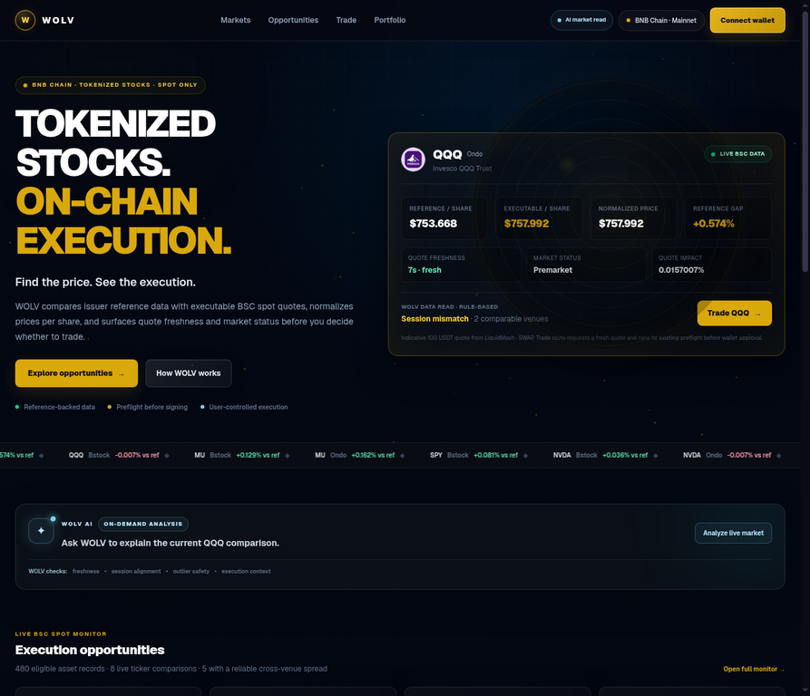
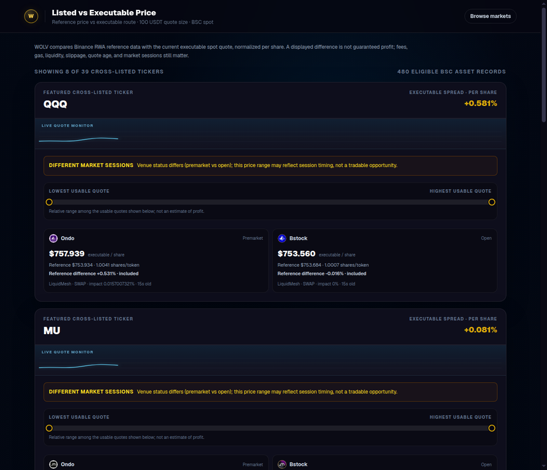
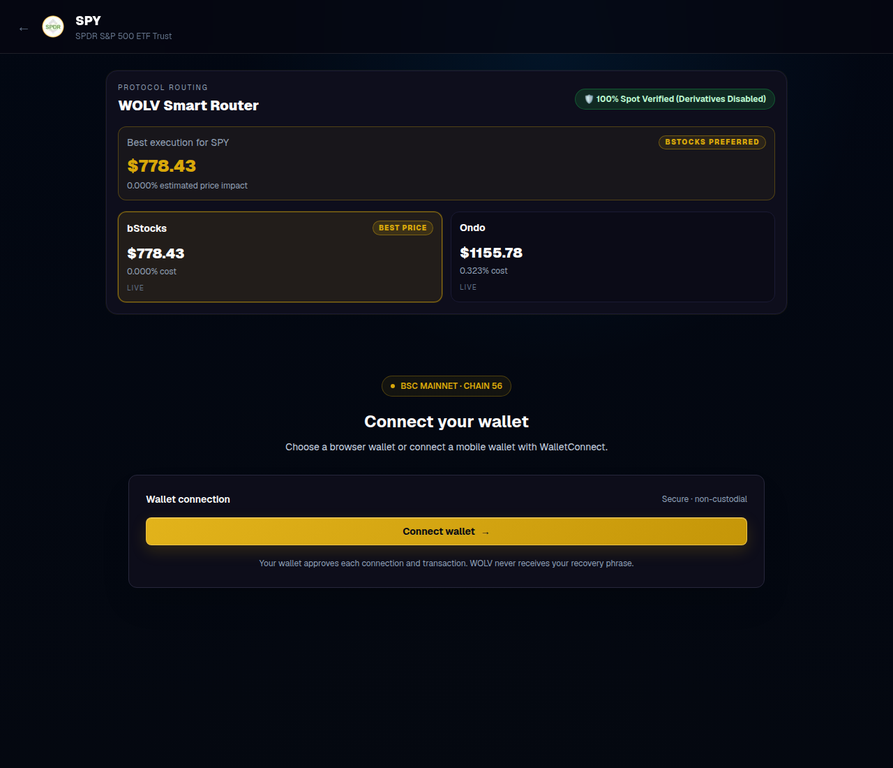

# WOLV Spot Lens

**See the price. Trust the route.**

WOLV Spot Lens is a BNB Smart Chain (**BSC**) tokenized-stock discovery, price-gap monitoring, and user-authorized spot-trading terminal. It compares issuer/listed reference data with executable quotes, normalizes prices per underlying share, explains quote freshness and market status, and lets a user decide whether to continue into a protected wallet flow.

> A displayed spread is not guaranteed profit. It may reflect fees, gas, liquidity, slippage, quote age, market-session differences, or execution changes.

[](https://wolv-stock.vercel.app)
[](https://www.bnbchain.org/en)
[](https://www.bnbchain.org/en/hackathons/tokenized-stocks)

- **Live application:** [wolv-stock.vercel.app](https://wolv-stock.vercel.app)
- **Repository:** [github.com/sollid-web/wolv-stock](https://github.com/sollid-web/wolv-stock)
- **Hackathon:** [BNB Hack: Tokenized Stocks Edition](https://www.bnbchain.org/en/hackathons/tokenized-stocks)
- **Demo video:** [Watch the WOLV walkthrough on YouTube](https://youtu.be/E6QEMJIIAfg?si=Jw3AtuueLI4-Aj2Z)
- **Developer Experience Report:** [DevReport.MD](./DevReport.MD)
- **License:** [MIT](./LICENSE)

## Why WOLV exists

Tokenized-stock users often see a reference price without knowing whether that price is executable for their trade size, through a particular venue, at the current moment. WOLV makes that distinction visible:

- **Reference price:** issuer/listed or underlying-share reference data.
- **Executable price:** what the selected route currently quotes for the requested trade size.
- **Gap:** a normalized comparison, not a promise of arbitrage.
- **Context:** quote age, venue, execution mode, price impact, market status, token/share ratio, and reliability checks.

The product is designed for Web2 users who need a clear explanation before they encounter wallet approval and transaction confirmation.

## Current live deployment

The following screenshots were captured from the live application on **9 October 2026** after verifying the current upstream commit and successful Vercel deployment:

- Repository commit: [`d41731d`](https://github.com/sollid-web/wolv-stock/commit/d41731d73fdf9d8c7815b8dbbc9527bfc66a534a)
- Vercel deployment: [completed successfully](https://vercel.com/ozoani/wolv-stock/2hLzFWePkuFrpHWvMiAXBWTUZKba)

### Homepage and WOLV AI entry point



### Cross-venue gap monitor



### User-controlled trade route



## What is implemented

### Market discovery and analysis

- Browse spot-eligible tokenized equities on BSC.
- Explore asset details, issuer information, market status, and reference data.
- Compare supported representations across venues such as **Ondo** and **bStocks**, where available.
- Use the `/gap` monitor to compare reference-backed executable quotes across venues.
- Exclude stale, malformed, missing-reference, and extreme outlier comparisons from reliable rankings.
- Surface market-session mismatches instead of presenting them as clean trading opportunities.
- Open WOLV AI market analysis for a grounded, plain-English explanation of the displayed data.

### Protected spot trading

- Request a fresh quote for a supported asset and trade amount.
- Enforce the Binance minimum order requirement at the application boundary.
- Validate spot eligibility, addresses, amounts, chain, quote freshness, and quote binding.
- Prepare swap or RFQ flows according to the returned execution mode.
- Simulate supported transactions before wallet approval.
- Revalidate the prepared transaction and run the applicable preflight before wallet approval/signing; the current normal `SWAP` path reuses the prepared calldata from `/api/swap` rather than fetching a new payload immediately before signing.
- Ask the connected wallet to approve and broadcast; WOLV does not custody private keys.
- Show wallet-prompt, submitted, pending, confirmed, failed, and user-rejected states.
- Read the BSC receipt and expose transaction evidence for verification.

### Read-only portfolio view

`/wallet` provides a read-only holdings and portfolio surface for the connected address. It does not sign, approve, or execute transactions.

## Product routes

| Route | Purpose |
|---|---|
| `/` | Data-led homepage with executable-price comparison, freshness/session context, WOLV AI entry points, and opportunity discovery |
| `/gap` | Reference-versus-executable cross-venue monitor with reliability exclusions and market-status context |
| `/markets` | Searchable BSC spot-eligible tokenized-stock directory |
| `/stock/:address` | Asset detail, issuer/reference information, chart data when available, executable quote, and trade entry |
| `/trade` | Spot-eligible asset selection |
| `/trade/:address` | Quote, simulation, approval, and user-confirmed spot-trade flow |
| `/wallet` | Read-only BSC holdings and portfolio overview |

If an upstream feed is unavailable, malformed, or empty when an unfiltered market list is expected, WOLV shows an explicit unavailable state. It does not substitute sample prices or imply a verified opportunity.

## Trading flow

```text
Select asset
   ↓
Request fresh quote
   ↓
Validate spot eligibility, amount, freshness, and quote binding
   ↓
Prepare swap/RFQ transaction
   ↓
Simulate where supported
   ↓
Refresh calldata immediately before signing
   ↓
User reviews and confirms in their wallet
   ↓
Wallet broadcasts on BSC
   ↓
WOLV reads receipt/status and links to on-chain evidence
```

A successful simulation is **not** an approval, broadcast, or confirmed transaction. A quote ID is also not automatically an order ID; direct on-chain swaps and off-chain RFQ order workflows have different status semantics.

## Architecture and safety boundaries

- **RWA Data API:** token/platform lists, metadata, issuer profiles, reference prices, and market-status fields.
- **Trading API:** aggregator quotes, swap details, approval data, and RFQ order submission/status where returned.
- **Transaction API:** Binance-signed BSC simulation before wallet prompts.
- **Wallet execution:** approval and direct SWAP transactions use the connected wallet’s normal confirmation flow; RFQ execution uses wallet typed-data signing and Binance order status polling.
- **Wallet API:** read-only BSC balances and portfolio overview.
- **Server-only credentials:** `BINANCE_API_KEY` and `BINANCE_SECRET_KEY` are read by server-side code and must never be exposed through `NEXT_PUBLIC_` variables.
- **Quote protection:** freshness checks, minimum-order validation, quote binding, address validation, spot filtering, and simulation gates remain part of the trade boundary.

### Important limitations

The following are not represented as fully solved:

- The outbound Binance request queue is process-local, not a distributed rate limiter.
- Static official router/spender allowlisting remains a separate hardening topic and must be verified against current official contract data before public mainnet use.
- Immediate pre-signing swap-calldata refresh remains a separate hardening item for the normal `SWAP` path.
- WOLV does not independently recover the signer for Binance-supplied RFQ typed data.
- Agentic Wallet, Wallet Skills, and BNB Agent Studio are not integrated into the current main-track product.
- The app does not geofence or determine legal eligibility; users and participants must review current official terms and applicable laws.

## Verified BNB Smart Chain mainnet execution evidence

The final developer report records three **actual BNB Smart Chain mainnet transactions** and their limitations. Each BscScan link below points to a mainnet transaction record, not a testnet or simulated result:

| Evidence | Transaction | What it demonstrates |
|---|---|---|
| Sunday off-hours trade | [`0x5f9955…c68855`](https://bscscan.com/tx/0x5f995506ecf2b4f5e407414bcf379f4f34bf538040e0e3e9ca92040b80c68855) | Successful `NVDAon` execution on October 4, 2026 at 22:52:59 UTC; BscScan displayed an internal execution-reverted warning despite overall success |
| Weekday demo trade | [`0x3bd762…60367`](https://bscscan.com/tx/0x3bd762832f273a1553341f935c02533e1aca0107730cac62af2e66ec94860367) | Successful `NVDAB` execution shown in the demo evidence |
| Earlier NVDAB trade | [`0x93d347…638e9`](https://bscscan.com/tx/0x93d34764fd6d7b3be7662e283b5357e4ab086e2b286596f97989b49d0e8638e9) | Successful execution and evidence that raw BEP-20 and UI transfer amount fields can differ |

These BNB Smart Chain mainnet records demonstrate actual execution evidence, not guaranteed liquidity or continuous availability for every tokenized stock. A simulation or quote alone is not counted as execution evidence.

## Demonstration

The final report documents the recorded walkthrough:

[Watch the WOLV demonstration](https://youtu.be/E6QEMJIIAfg?si=Jw3AtuueLI4-Aj2Z)

The walkthrough covers:

1. Tokenized-stock discovery through `/markets`.
2. NVIDIA selection and reference-price-gap presentation.
3. Visible handling of an execution-reverted error.
4. Retrieval of a fresh executable quote.
5. MetaMask confirmation and user-authorized BSC execution.
6. Transaction confirmation and independent BscScan verification.

For submission, the transaction hash displayed in the recording should be included alongside the relevant explorer link so judges can independently inspect status, transfers, contracts, and amounts.

## Technology stack

- Next.js 16 App Router
- React 19
- TypeScript
- Tailwind CSS 4
- Wagmi / Viem
- Recharts and Lightweight Charts where used by the current UI
- Binance Web3 RWA, Trading, Transaction, Wallet, and Portfolio APIs
- BNB Smart Chain
- Vercel

## Local development

### Requirements

- Node.js supported by Next.js 16
- pnpm
- Binance Web3 API credentials for live server routes
- An injected EVM wallet or WalletConnect project ID for wallet testing

### Configure environment variables

Create `.env.local` with server-only credentials:

```dotenv
BINANCE_API_KEY=your_web3_api_key
BINANCE_SECRET_KEY=your_web3_api_secret

# Optional when using WalletConnect; injected wallets can be tested without it
NEXT_PUBLIC_WALLET_PROJECT_ID=your_walletconnect_project_id

# Optional server-side WOLV AI explanation layer
WOLV_AI_API_KEY=your_openai_compatible_key
WOLV_AI_BASE_URL=https://api.openai.com/v1
WOLV_AI_MODEL=gpt-5-mini
```

Never commit `.env.local`, private keys, wallet seed phrases, or API secrets.

### Install and run

```bash
git clone https://github.com/sollid-web/wolv-stock.git
cd wolv-stock
pnpm install --frozen-lockfile
pnpm dev
```

Open [http://localhost:3000](http://localhost:3000).

The project’s development and build scripts use the Webpack path. Production builds may need network access for `next/font/google`.

## Checks

```bash
pnpm test:logic
pnpm test:hardening
pnpm exec tsc --noEmit
pnpm lint
pnpm build
```

For a production-route responsive pass:

```bash
pnpm build
pnpm start
# in another terminal
pnpm test:responsive
```

The responsive runner checks `/`, `/gap`, `/markets`, `/trade`, and `/wallet` at mobile, tablet, and desktop widths. Set `TEST_TOKEN_ADDRESS` to include `/stock/:address` and `/trade/:address` detail cases. These checks do not connect a wallet, sign, or broadcast a transaction.

## Developer documentation

- [Developer Experience Report](./DevReport.MD) — final builder report covering onboarding, authentication, API pitfalls, wallet behavior, tokenized-stock findings, evidence, and platform recommendations.
- [Trading Architecture](./TRADING_ARCHITECTURE.md) — current request flow, signing boundaries, route behavior, and remaining hardening topics.
- [WOLV Spot Lens handoff](./WOLV-SPOT-LENS-HANDOFF.md) — project context and continuation notes, when present locally.

## BNB Chain hackathon scope

WOLV is focused on the main tokenized-stocks track:

- BNB Smart Chain mainnet
- Spot tokenized-equity discovery and trading
- User-authorized, non-custodial wallet execution
- Clear distinction between reference prices and executable quotes
- No perpetuals
- No autonomous trade execution

Eligibility, restricted-region rules, and submission requirements are the participant’s responsibility. Review the [official hackathon rules](https://www.bnbchain.org/en/hackathons/tokenized-stocks) and current Binance terms before submission.

## Risks and disclaimer

Tokenized stocks are blockchain-based products whose availability, pricing, redemption rights, restrictions, and risks depend on their respective issuers and platforms. Reference prices do not guarantee executable prices. Liquidity, slippage, trading restrictions, gas, network conditions, market hours, and quote changes may affect execution.

WOLV is a software interface, not a guarantee of liquidity, price parity, investment returns, legal eligibility, or transaction success. This project is provided for demonstration and informational purposes. Users are responsible for independently evaluating tokenized-stock products, wallet prompts, transaction details, and applicable restrictions.

## License

The application source is released under the [MIT License](./LICENSE). The disclaimer above remains applicable to the project and its use with tokenized-stock products.
